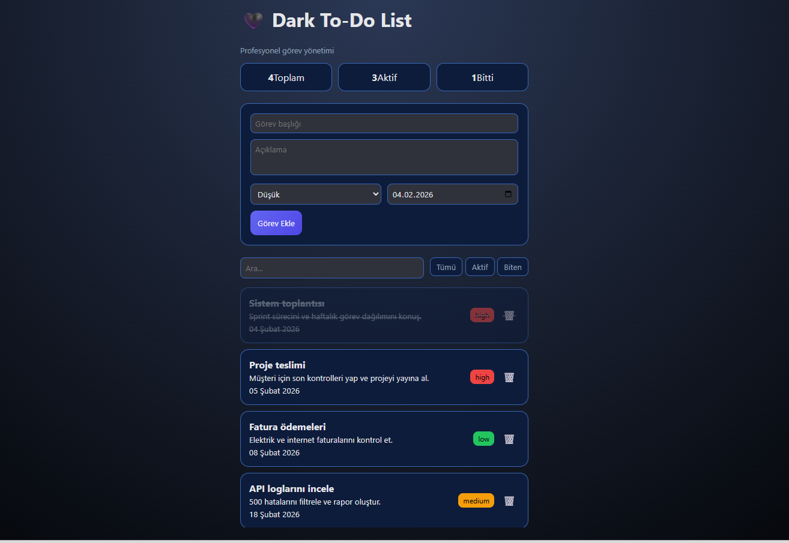

# 📅 Tarih Seçimli Liste Uygulaması

Modern tasarıma sahip, koyu tema kullanılan ve tarih seçimi ile liste yönetimi yapılabilen basit ama işlevsel bir web uygulaması.

Bu proje; tarih seçme, listeye veri ekleme ve eklenen verileri silme gibi temel işlemleri kullanıcı dostu bir arayüzle sunar.

---

## 🚀 Özellikler

- 📆 **Tarih Seçimi**
  - Native HTML date input kullanımı
  - Tarayıcı uyumlu tarih seçici
- ➕ **Listeye Veri Ekleme**
  - Seçilen tarih ve girilen veri listeye eklenir
- 🗑️ **Liste Silme**
  - Eklenen her öğe tek tek silinebilir
- 🌙 **Modern Koyu Tema**
  - CSS değişkenleri (`:root`) ile yönetilen tema
  - Göz yormayan, açık tonlu koyu renk paleti
- 🎨 **Temiz & Minimal UI**
  - Kart yapısı
  - Hover ve transition efektleri

---

## 🧩 Kullanılan Teknolojiler

- **HTML5**
- **CSS3**
  - CSS Variables
  - Flexbox
- **JavaScript (Vanilla JS)**
  - DOM Manipülasyonu
  - Event Handling

